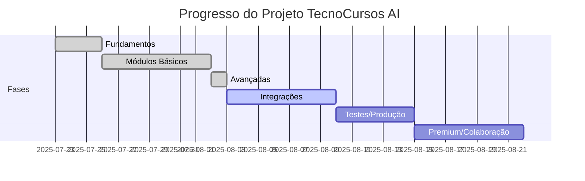

# 📊 Status das Fases do Projeto TecnoCursos AI

Este arquivo serve para acompanhar o progresso de cada fase do desenvolvimento do editor de vídeos.

## Checklist Geral

- [x] **Fase 1: Arquitetura e Fundamentos**
    - Estrutura de pastas
    - Setup inicial (backend/frontend)
    - Documentação e automação básica
- [x] **Fase 2: Módulos Básicos do Editor**
    - AssetPanel
    - EditorCanvas
    - SceneList
    - Timeline
    - Toolbar
    - Estado global (Zustand)
- [x] **Fase 3: Funcionalidades Avançadas**
    - PropertyPanel - Edição de propriedades
    - LayerControls - Controle de camadas
    - ContextMenu - Menu de contexto
    - AnimationPanel - Configuração de animações
    - UndoRedoManager - Sistema de histórico (undo/redo)
    - 23 testes unitários implementados
- [ ] **Fase 4: Integrações e Exportação**
    - Exportação de vídeo
    - TTS
    - Avatares IA
    - Upload/download de assets
    - Notificações
- [ ] **Fase 5: Testes, Performance e Produção**
    - Testes unitários e integração
    - Build de produção
    - Monitoramento
    - Documentação final
- [ ] **Fase 6: Funcionalidades Premium e Colaboração**
    - Templates prontos
    - Colaboração em tempo real
    - Plugins/extensões
    - Analytics
    - PWA

---

## Progresso Visual

---

## Relatórios de Fases Concluídas

- [x] **Fase 1:** `docs/RELATORIO_FINAL_FASE_1.md` (Pendente)
- [x] **Fase 2:** `docs/RELATORIO_FINAL_FASE_2.md` (Pendente)
- [x] **Fase 3:** `docs/RELATORIO_FINAL_FASE_3.md` ✅ **CONCLUÍDO**

---

## Como Usar este Controle

- Marque cada item concluído com `[x]`.
- Ao finalizar uma fase, gere um relatório em `docs/RELATORIO_FINAL_FASE_X.md`.
- Use este arquivo para reuniões de acompanhamento e planejamento.
- Atualize as datas conforme o andamento real do projeto.

---

**Última atualização:** 23 de Julho de 2025 - Fase 3 concluída com sucesso 