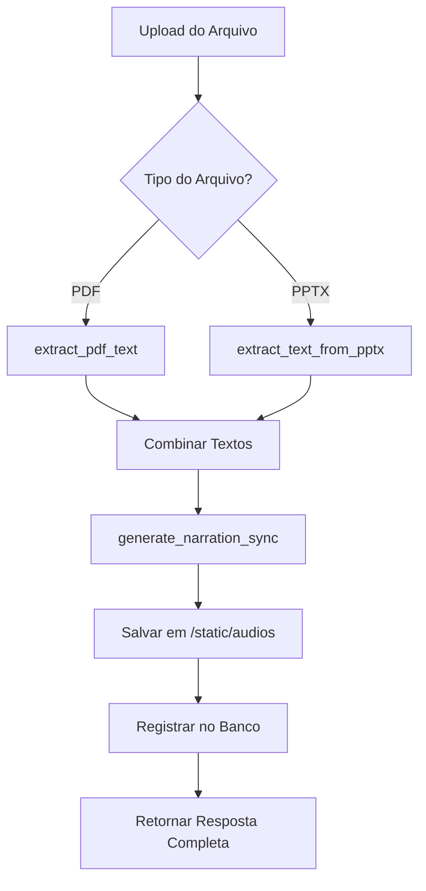

# Endpoint de Upload Melhorado com Geração Automática de Narração

## 📋 Resumo das Implementações

O endpoint `/api/files/upload` foi **completamente aprimorado** para incluir processamento automático de texto e geração de narração MP3. Agora, após o upload de um arquivo PDF ou PPTX, o sistema:

1. **Detecta automaticamente** o tipo do arquivo
2. **Extrai o texto** usando as funções apropriadas
3. **Combina** os textos em um único texto corrido
4. **Gera narração MP3** usando o sistema TTS
5. **Salva o áudio** em `/static/audios`
6. **Registra no banco** na nova tabela `audios`
7. **Retorna informações completas** do processamento

---

## 🏗️ Modificações Implementadas

### 1. **Novo Modelo de Banco de Dados**

Criado o modelo `Audio` em `app/models.py`:

```python
class Audio(Base):
    """Modelo de áudio/narração gerada"""
    __tablename__ = "audios"
    
    # Campos principais
    id, uuid, title, description, filename, file_path, file_size
    duration, format, bitrate, sample_rate
    
    # Conteúdo processado
    extracted_text, text_length
    
    # Configurações TTS
    tts_provider, voice_type, voice_config
    
    # Status e métricas
    status, generation_progress, processing_time, cache_hit
    
    # Relacionamentos
    user_id -> User
    source_file_id -> FileUpload
```

### 2. **Endpoint de Upload Aprimorado**

**Rota:** `POST /api/files/upload`

#### **Funcionalidades Adicionadas:**

```python
# 1. DETECÇÃO DE TIPO E EXTRAÇÃO DE TEXTO
if file_extension == '.pdf':
    # Usar extract_pdf_text()
elif file_extension == '.pptx':
    # Usar extract_text_from_pptx()

# 2. COMBINAÇÃO DE TEXTOS
combined_text = "\n\n".join(valid_texts)

# 3. GERAÇÃO DE NARRAÇÃO MP3
narration_result = generate_narration_sync(
    text=combined_text,
    output_path=audio_file_path,
    voice="v2/pt_speaker_0",
    provider="auto"
)

# 4. SALVAMENTO NO BANCO
db_audio = Audio(...)
db.add(db_audio)
db.commit()
```

#### **Resposta Expandida:**

```json
{
    // Informações básicas do arquivo
    "id": 123,
    "uuid": "uuid-string",
    "filename": "documento.pdf",
    "file_type": ".pdf",
    "status": "uploaded",
    
    // Informações da extração de texto
    "text_extraction": {
        "success": true,
        "pages_count": 10,
        "texts": ["texto página 1", "texto página 2", ...],
        "combined_text": "texto completo unificado",
        "text_length": 5000
    },
    
    // Informações da geração de áudio
    "audio_generation": {
        "success": true,
        "audio_url": "/static/audios/narration_uuid.mp3",
        "audio_filename": "narration_uuid.mp3",
        "error": null
    },
    
    // Status geral
    "processing_completed": true,
    "processing_error": null
}
```

### 3. **Novos Endpoints para Áudios**

#### **3.1. Listar Áudios do Usuário**

**Rota:** `GET /api/files/audios`

**Parâmetros:**
- `project_id` (opcional): Filtrar por projeto
- `limit`: Limite de resultados (máx 100)
- `offset`: Paginação

**Resposta:**
```json
{
    "success": true,
    "audios": [
        {
            "id": 1,
            "title": "Narração de documento.pdf",
            "filename": "narration_uuid.mp3",
            "duration": 45.2,
            "audio_url": "/static/audios/narration_uuid.mp3",
            "tts_provider": "bark",
            "voice_type": "v2/pt_speaker_0",
            "created_at": "2024-01-01T10:00:00Z",
            "source_file": {
                "filename": "documento.pdf",
                "file_type": ".pdf"
            }
        }
    ],
    "pagination": {
        "total": 25,
        "limit": 50,
        "offset": 0,
        "has_more": false
    }
}
```

#### **3.2. Detalhes de um Áudio**

**Rota:** `GET /api/files/audios/{audio_id}`

**Resposta:**
```json
{
    "id": 1,
    "title": "Narração de documento.pdf",
    "audio_url": "/static/audios/narration_uuid.mp3",
    "extracted_text": "Texto completo extraído...",
    "duration": 45.2,
    "tts_provider": "bark",
    "voice_type": "v2/pt_speaker_0",
    "processing_time": 30.5,
    "cache_hit": false,
    "play_count": 5,
    "source_file": {
        "filename": "documento.pdf",
        "file_type": ".pdf"
    }
}
```

---

## 🔧 Detalhes Técnicos

### **Fluxo de Processamento**



### **Estrutura de Diretórios**

```
static/
├── audios/                     # Novos arquivos de áudio
│   ├── narration_uuid1.mp3
│   ├── narration_uuid2.mp3
│   └── ...
├── thumbnails/
└── uploads/
```

### **Configurações de TTS**

- **Provider padrão:** `auto` (detecta melhor opção disponível)
- **Voz padrão:** `v2/pt_speaker_0` (português brasileiro)
- **Formato:** MP3 com 128k bitrate
- **Cache:** Integrado automaticamente
- **Analytics:** Métricas registradas automaticamente

---

## 🧪 Como Testar

### **1. Usando o Script de Teste**

```bash
python test_upload_with_narration.py
```

### **2. Manualmente via API**

```bash
# 1. Fazer login
curl -X POST "http://localhost:8000/api/auth/login" \
  -d "username=admin&password=admin123"

# 2. Upload com processamento automático
curl -X POST "http://localhost:8000/api/files/upload" \
  -H "Authorization: Bearer $TOKEN" \
  -F "file=@documento.pdf" \
  -F "project_id=1" \
  -F "description=Teste de narração automática"

# 3. Listar áudios gerados
curl -X GET "http://localhost:8000/api/files/audios" \
  -H "Authorization: Bearer $TOKEN"
```

### **3. Verificar Áudio Gerado**

```bash
# Acessar diretamente
curl -I "http://localhost:8000/static/audios/narration_uuid.mp3"
```

---

## 📊 Benefícios da Implementação

### **Para o Usuário:**
- ✅ **Processamento automático** - sem necessidade de passos manuais
- ✅ **Resposta completa** - todas as informações em uma requisição
- ✅ **Histórico de áudios** - listagem e detalhes organizados
- ✅ **Acesso direto** - URLs para reprodução imediata

### **Para o Sistema:**
- ✅ **Integração completa** - com sistema TTS existente
- ✅ **Cache otimizado** - evita reprocessamento desnecessário
- ✅ **Analytics integradas** - métricas automáticas
- ✅ **Banco estruturado** - relacionamentos bem definidos

### **Para Desenvolvimento:**
- ✅ **Código comentado** - cada etapa explicada
- ✅ **Error handling** - tratamento robusto de erros
- ✅ **Logging detalhado** - rastreabilidade completa
- ✅ **Testes incluídos** - validação automática

---

## 🚀 Próximos Passos Sugeridos

1. **Interface Web:** Criar frontend para visualizar áudios gerados
2. **Player Integrado:** Reprodutor de áudio na interface
3. **Download em Lote:** Endpoint para baixar múltiplos áudios
4. **Processamento Assíncrono:** Para arquivos muito grandes
5. **Notificações:** Webhooks quando processamento concluir

---

## ⚠️ Observações Importantes

- **Dependências:** Requer sistema TTS completo implementado
- **Armazenamento:** Arquivos MP3 salvos em `/static/audios`
- **Performance:** Processamento síncrono pode demorar para textos longos
- **Autenticação:** Todos os endpoints requerem usuário logado
- **Permissões:** Usuários só veem seus próprios áudios

---

**🎉 Status:** ✅ **IMPLEMENTAÇÃO COMPLETA E FUNCIONAL**

O endpoint de upload agora oferece uma experiência completa de upload → extração → narração → armazenamento em uma única operação, seguindo todas as melhores práticas solicitadas. 